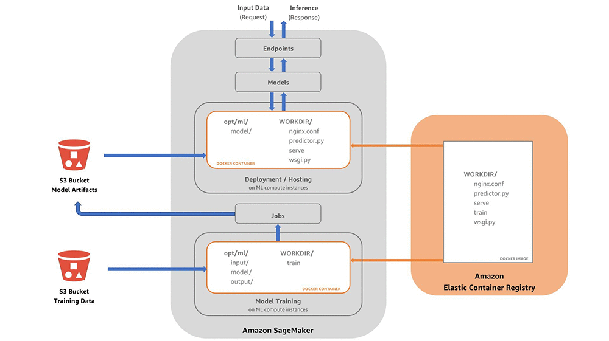
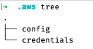
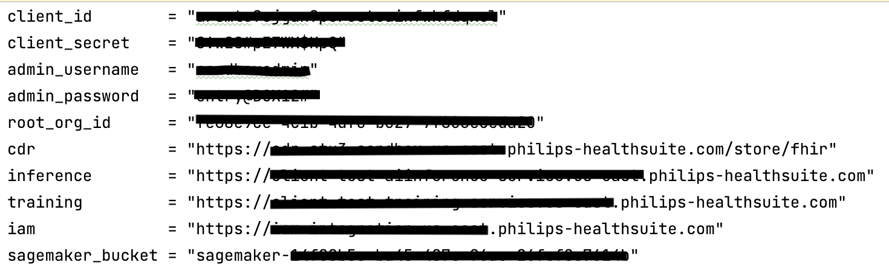

# Heart Disease Prediction using HSP AI Inference

This example helps you learn how to build your own algorithms, and that can be trained and deployed in SageMaker
environment using HSP AI inference service.

In this example, you will accomplish the following goals:

- How to build your own algorithm container?
- Uploading your algorithm for use with SageMaker
- Train the model in local machine
- Hosting your trained model using HSP
- Create an endpoint for prediction
- Test inference using processed FHIR patient data

**Note:** This sample is created by following one of the AWS SageMaker
example: [Building your own algorithm container](https://github.com/aws/amazon-sagemaker-examples/blob/main/advanced_functionality/scikit_bring_your_own/scikit_bring_your_own.ipynb)

## Prerequisites

Following tools must be installed in your local machine

1. [Docker Desktop](https://www.docker.com/get-started/)
2. [AWS CLI](https://aws.amazon.com/cli/)
3. [Python>=3.6](https://www.python.org/downloads/)
4. [Terraform>=1.2.7](https://www.terraform.io/downloads)

Following on-boarding shall be done in your HSP account

1. [HSP AI Inference](https://www.hsdp.io/documentation/ai-inference)
2. [HSP CDR](https://www.hsdp.io/documentation/clinical-data-repository) [Optional]

## Step1: Building your own container

This container is created based on a suggested folder structure in AWS SageMaker example.

Let's look at each file under container folder:

- `nginx.conf` - Used to host Python Flask web application
- `wsgi.py` - Serve as the entry point for your web application
- `predictor` - Web application that exposes the inference endpoint for prediction
- `serve` - Main routine that starts the web application while running the container
- `train` - Main routine that starts the training process while running the container

The same container can be used to train a model or running inference job on test data. Typically, docker containers are
build with an `ENTRYPOINT`. Since we run the same container for both training and inference, the startup program is
specified at the time of running the container.

To run the container as train program, the command is

`docker run <image> train`

To run the container as inference program,

`docker run <image> serve`

For more details about, how Amazon SageMaker runs the container, refer
this [blog](https://aws.amazon.com/blogs/machine-learning/train-and-host-scikit-learn-models-in-amazon-sagemaker-by-building-a-scikit-docker-container/)

### About training algorithm

Heart disease prediction follows supervised learning approach by looking at 3 vitals, `Heart Rate`
, `Systolic Blood Pressure` and `Diastolic Blood Pressure`. The training data (heart.csv) includes sample measurements
from various patients and a target which has a value of `1` or `0`. `1` represents patient had heart disease and `0`
represents no heart disease.

`train` file contains the logic for training the data using Scikit kNN classifier algorithm. To learn more about kNN
classifier,
refer [here](https://towardsdatascience.com/intro-to-scikit-learns-k-nearest-neighbors-classifier-and-regressor-4228d8d1cba6)
. At the end of successful training, it creates a model and package it as `.pkl` file.

You can fork and extend the algorithm to create new model, by adding more vitals, to build better heart prediction
models.

**NOTE:** The input data is expected with headers.

### About prediction

When you run the container as inference service, Amazon SageMaker looks at two endpoints

1. `/ping` - Used to check if the service is up and ready to run invocations
2. `/invocations` - Used to run the inference

These APIs are generic, and it can be implemented the way you want to serve the requests. For heart disease prediction,
the input data is expected to be in csv format with headers. The input data is passed to a trained model to do the
predictions. After successful prediction, score will be returned in `JSON` format with the following properties:

- `results` - Returns 1's and 0's based on the number of rows in the test data
- `accuracy` - Returns an accuracy of predication based on test data variability

You can fork and change the implementation for API endpoints according to your need.

### Build and push

Assuming you have installed Docker and AWS CLI, add `.aws` folder to your home path (if not done already) in your local
machine as follows:

- Set the `region` and `output` in config file
- Set `aws_access_key_id` and `aws_secret_access_key` in credentials file

After you configure AWS CLI with HSP provided credentials in your local machine, you can run the shell script as follows

`./build_and_push.sh <image>` - where <image> is the name of the image

**NOTE:** Name of the image MUST start with `sagemaker-`, if you need to use the image in HSP AI inference service

## Testing in local machine

In order to test the model locally, follow the steps to train and test the algorithm

1. Build the container locally

- Run command `docker build -t hsp_heart_demo .` from commandline from Dockerfile file path
- This will create a `hsp_heart_demo:latest` image in your local system

2. Train and create the model

- Go to `/local_test` directory from commandline
- Run command `./train_local.sh hsp_heart_demo`
- A model file named `hsp-heart-knn-model.pkl` will be generated under `model` directory

3. Start the inference endpoint using the model

- Run command `./serve_local.sh hsp_heart_demo`
- This will start the web application and waits for inference requests
- NOTE: *You can close it once prediction is complete, via keyboard interrupt*

4. Run prediction using test data

- Start a new commandline
- Run command `./predict.sh ../data/payload.csv text/csv`
- Results will be returned if successful

**WARNING:** `.pkl` file generated in Mac with Apple chip does not work as expected. Damn Apple!

## Testing using HSP AI Inference

If the model is working as expected locally, let's try pushing the same model to HSP and run inference through HSP AI
inference services

1. Build and push the container

- Go to `container` directory from commandline
- Run command `./build_and_push.sh sagemaker-hsp_heart_demo`
- This will build a new docker image and upload the same to AWS ECR registry

2. Upload model and test data to HSP SageMaker S3 location

- Go to `/hsp_test/test_dir` directory from commandline
- Run command `./upload_data.sh <your_s3_bucket> HspHeartDemo`
- This command will upload
    - model file (`/test_dir/model/model.tar.gz`)
    - test data (`/test_dir/input/data/test/payload.csv`)
- NOTE: *`.pkl` file should exist in `/local_test/test_dir/model` path for this step to work. Alternatively you can copy
  model file to `hsp_test/test_dir/model` path as well*

3. Host inference endpoint in AWS SageMaker through HSP AI inference service and run prediction

- Go to `/hsp_test` directory from commandline
- Make sure you configure `terraform.tfvars` properties based on your HSP account

- Make sure you set your `project` name and `image` name in `terraform.tfvars` if you are using a different name other
  than default provided in `variables.tf`
- Run command `terraform init`
- Run command `terraform apply`. This will do the following steps
    1. Creates a compute environment using AI inference
    2. Retrieves one of the existing compute target
    3. Deploy model uploaded to S3, using compute environment
    4. Creates inference endpoint by hosting the compute environment into compute target
    5. Wait for 5 minutes for the inference endpoint to be `InService` state
    6. Run prediction with test data, using Score API of inference
    7. Wait for 5 seconds to complete
    8. Download the results from S3 to `/test_dir/output` location
    9. Display the results

NOTE: If your inference hosting time is more than 5 mins, terraform script will fail after creating the inference
endpoint. In that case, you can run `terraform apply` again after sometime and it will run pending steps.

4. Clean up the endpoint after test

- Run command `terraform destroy` to clean up all resources created by HSP AI inference service

### Testing with CDR data

If you want to test the algorithm using your own CDR patient data, we need to process CDR FHIR patient Observations and
translate them to flat CSV structure, that predict algorithm understands.

- Go to `/test_dir/input/data/cdr` directory from commandline
- Make sure you configure `terraform.tfvars` properties based on your HSP account
- Pass a valid `patient_id` from your CDR instance as part of the config
- Make sure patient data has the following vitals: `Heart Rate`, `Systolic Blood Pressure`
  and `Diastolic Blood Pressure`
- **NOTE:** FHIR version `R4` is set as default. if you want to use old version, change the default to `R3`
  in `variables.tf` file
- Run command `terraform init`
- Run command `terraform apply`. This will fetch all observations of the patient from CDR and process the data to
  generate a final inference ready test data
- Check if the test data file `heart_vitals.csv` is created successfully in the current directory
- Once the file is available, go to `/hsp_test/test_dir` directory from commandline
- Run command `./upload_data.sh <bucket> HspHeartDemo cdr`. This will upload CDR generated test data to AI S3 location
- Go to `/hsp_test` directory from commandline
- Run command `terraform apply` to do prediction with CDR data
- Upon successful execution, the results will be available in `/hsp_test/test_dir/output` location

## Summary

You have now learned how to build, train, deploy AI model, host inference endpoint and do predictions using HSP AI
inference services!
