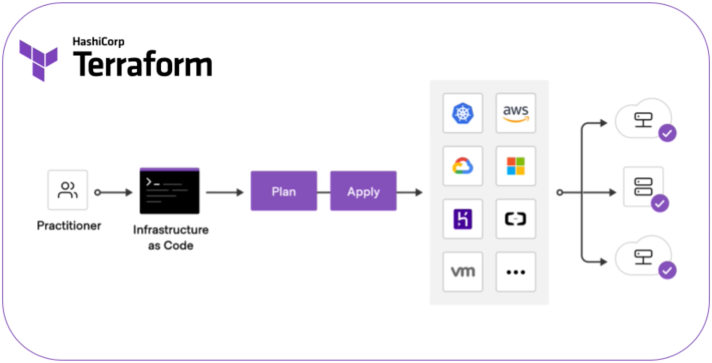
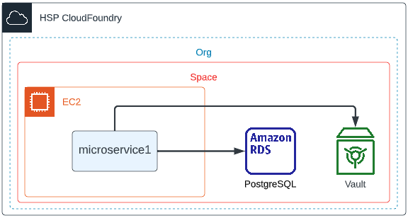
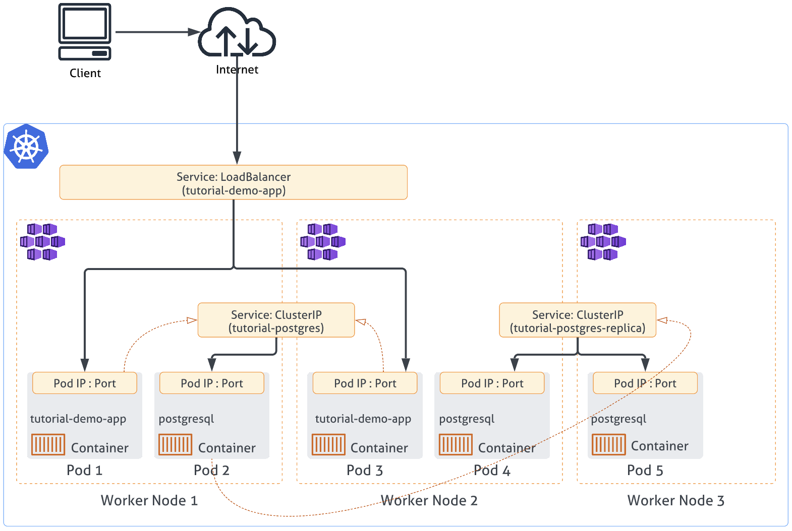
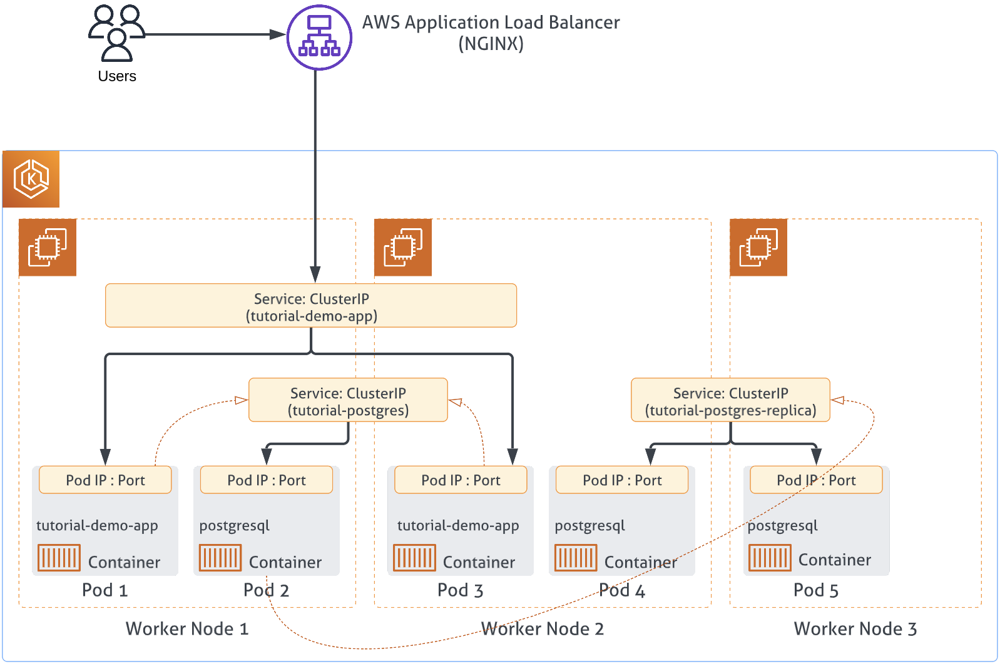

<!-- 
_color: white 
-->
# Terraform: From Zero to Hero

Shinoj Prabhakaran

---

<!-- _class: lead-->
# Pre-requisites
->Install multipass
->Create VMs in multipass for docker and k3s
->Install Terraform

---

<!-- _class: lead-->
# What will be covered?
->Terraform Basics
->Getting Started With:
-->1.Local Deployment
-->2.HSP Classic Deployment
-->3.Local K3S Deployment
-->4.HSP EKS Deployment

---

<!-- _class: lead-->
# Terraform

---

<!-- _class: lead-->
# Basics Demo
In this section, you will learn:
->How to write IaC?
->Using Provider
->Plan & Apply
->Update Plan
->Destroy

---

<!-- _class: lead-->
# HSP CloudFoundry Demo
In this section, you will learn:
->Deploy to CloudFoundry 
->With service broker dependency
-->By creating a HSP provided service   
->Structure your terraform scripts
-->Terraform Modules
->Understanding Terraform State
->And other useful commands...

---

<!-- _class: lead-->
# HSP CloudFoundry Demo

---

<!-- _class: lead-->
# HSP CloudFoundry Demo

---

<!-- _class: lead-->
# Kubernetes Demo
In this section, you will learn:
->How to deploy an application in Kubernetes cluster
->Applicable for HSP AWS services 

---

<!-- _class: lead-->
# Kubernetes Demo

---

<!-- _class: lead-->
# HSP AWS Demo
